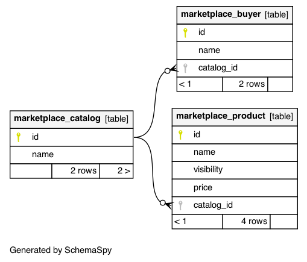

## Problem 1

We have a system where products can be placed into catalogs and buyers are assigned to a
catalog. Products can have different visibility settings. If the setting is “default” then any buyer
can see the product. If the visibility is “catalog_members” then only buyers who are a member of
a catalog including the product can see it. A query for products on behalf of a buyer should
return any product that has visibility “default” OR the product exists in a catalog that includes
the buyer. A product has a name, price, and visibility setting.

1. How would you model these relationships?
2. How would you write a SQL query to return the list of products?

## Solution

#### 1) Database schema-spy

I provide different kinds of dumps for the schema of the DB I've created, but for easier review, I suggest taking a look at the schema-spy folder.

- **problem-2/schemaspy** (recommended)
- **problem-2/schema-serialdump.sql** (simpler code for inspection)
- **problem-2/schema-pgdump.sql** (full pg_dump sql)

```shell
$ java -jar schemaspy-6.1.0.jar -db marketplace -dp postgresql-42.2.19.jar -host localhost -o schemaspy -s public -t pgsql -u jjlv -i 'buyer|catalog|product|product_catalog'
```



Testing data

```json
[
  {
    "model": "marketplace.buyer",
    "pk": 1,
    "fields": {
      "name": "b1",
      "catalog": 1
    }
  },
  {
    "model": "marketplace.buyer",
    "pk": 2,
    "fields": {
      "name": "b2",
      "catalog": 2
    }
  },
  {
    "model": "marketplace.buyer",
    "pk": 3,
    "fields": {
      "name": "b3",
      "catalog": 3
    }
  },
  {
    "model": "marketplace.catalog",
    "pk": 1,
    "fields": {
      "name": "c1"
    }
  },
  {
    "model": "marketplace.catalog",
    "pk": 2,
    "fields": {
      "name": "c2"
    }
  },
  {
    "model": "marketplace.catalog",
    "pk": 3,
    "fields": {
      "name": "c3"
    }
  },
  {
    "model": "marketplace.product",
    "pk": 1,
    "fields": {
      "name": "p1",
      "visibility": "catalog_members",
      "price": "1.00",
      "catalog": [
        1
      ]
    }
  },
  {
    "model": "marketplace.product",
    "pk": 2,
    "fields": {
      "name": "p2",
      "visibility": "catalog_members",
      "price": "2.00",
      "catalog": [
        2
      ]
    }
  },
  {
    "model": "marketplace.product",
    "pk": 3,
    "fields": {
      "name": "p3",
      "visibility": "catalog_members",
      "price": "3.00",
      "catalog": [
        3
      ]
    }
  },
  {
    "model": "marketplace.product",
    "pk": 4,
    "fields": {
      "name": "p4",
      "visibility": "catalog_members",
      "price": "4.00",
      "catalog": [
        1,
        2,
        3
      ]
    }
  },
  {
    "model": "marketplace.product",
    "pk": 5,
    "fields": {
      "name": "p5",
      "visibility": "default",
      "price": "5.00",
      "catalog": []
    }
  },
  {
    "model": "marketplace.product",
    "pk": 6,
    "fields": {
      "name": "p6",
      "visibility": "catalog_members",
      "price": "6.00",
      "catalog": []
    }
  }
]
```

#### 2) List of Products for Buyer - SQL Query

The requested SQL query is wrapped inside a PREPARE statement for easy testing and development.

```sql
DEALLOCATE get_products_for_buyer;

PREPARE get_products_for_buyer (int) AS
	SELECT product.id,
	       product.name,
	       product.visibility,
	       product.price
	  FROM product
	  LEFT OUTER JOIN product_catalog
	    ON (product.id = product_catalog.product_id)
	  LEFT OUTER JOIN catalog
	    ON (product_catalog.catalog_id = catalog.id)
	  LEFT OUTER JOIN buyer
	    ON (catalog.id = buyer.catalog_id)
	 WHERE (product.visibility = 'default' OR (product.visibility = 'catalog_members' AND buyer.id = $1))
	 ORDER BY product.id ASC;

EXECUTE get_products_for_buyer(1);
EXECUTE get_products_for_buyer(2);
EXECUTE get_products_for_buyer(3);
```
