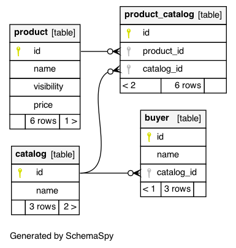

## Problem 1

We have a system where products can be placed into catalogs and buyers are assigned to a
catalog. Products can have different visibility settings. If the setting is “default” then any buyer
can see the product. If the visibility is “catalog_members” then only buyers who are a member of
a catalog including the product can see it. A query for products on behalf of a buyer should
return any product that has visibility “default” OR the product exists in a catalog that includes
the buyer. A product has a name, price, and visibility setting.

1. How would you model these relationships?
2. How would you write a SQL query to return the list of products?

## Solution

#### 1) Database schema-spy

```shell
$ java -jar schemaspy-6.1.0.jar \
  -db marketplace \
  -dp postgresql-42.2.19.jar \
  -host localhost \
  -i '.*marketplace_.+' \
  -o schemaspy \
  -s public \
  -t pgsql \
  -u jjlv
```



#### 2) List of Products for Buyer - SQL Query

```sql

PREPARE get_products_for_buyer (int) AS
  SELECT "marketplace_product"."id",
         "marketplace_product"."name",
         "marketplace_product"."visibility",
         "marketplace_product"."price",
         "marketplace_product"."catalog_id"
    FROM "marketplace_product"
    LEFT OUTER JOIN "marketplace_catalog"
      ON ("marketplace_product"."catalog_id" = "marketplace_catalog"."id")
    LEFT OUTER JOIN "marketplace_buyer"
      ON ("marketplace_catalog"."id" = "marketplace_buyer"."catalog_id")
   WHERE ("marketplace_product"."visibility" = 'default' OR 
         ("marketplace_product"."visibility" = 'catalog_members' AND 
          "marketplace_buyer"."id" = $1)
         )
   ORDER BY "marketplace_product"."id" ASC;

-- sample execution
EXECUTE get_products_for_buyer(1);
EXECUTE get_products_for_buyer(2);

-- deallocate the previously prepared SQL statement
DEALLOCATE get_products_for_buyer;
```
